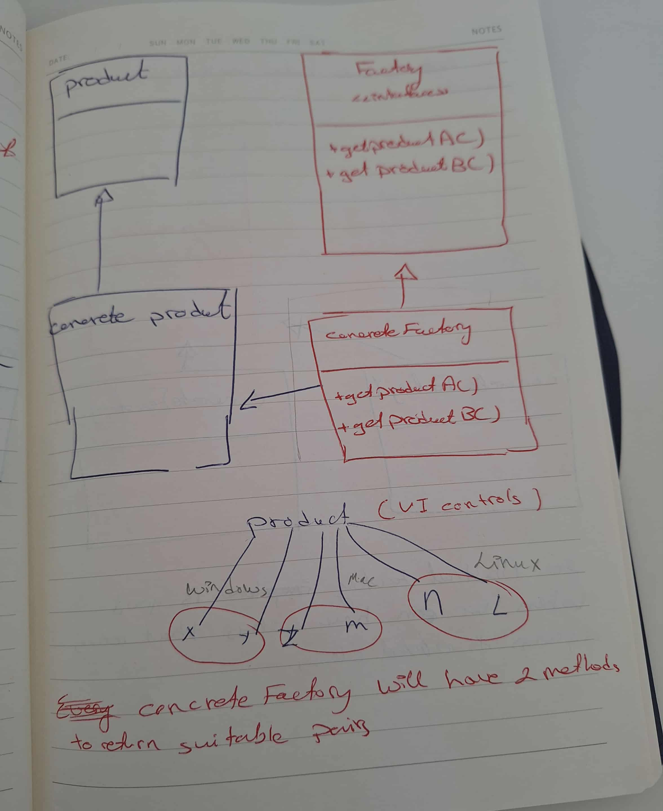

## Build A payment APP using factory pattern

We build a factory that is responsible for providing the suitable payment method type

then in payment processor we use the factory to get the suitable payment method type and do our work needed

## Solution UML [Factory Method patten]

## Factory method and abstract factory illustration

