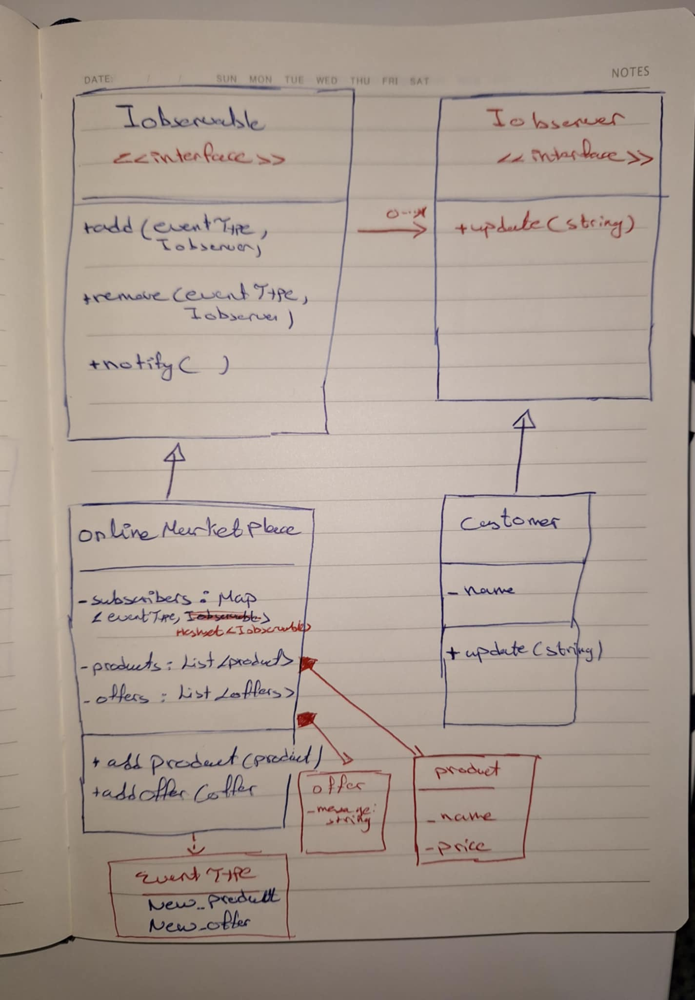

## Build a notification service
A notification service that send notifications to subscribers when a new product or a new offer is added
subscribers can subscribe to product updates and offer updates

## Observer pattern UML

## Example: Weather station UML

