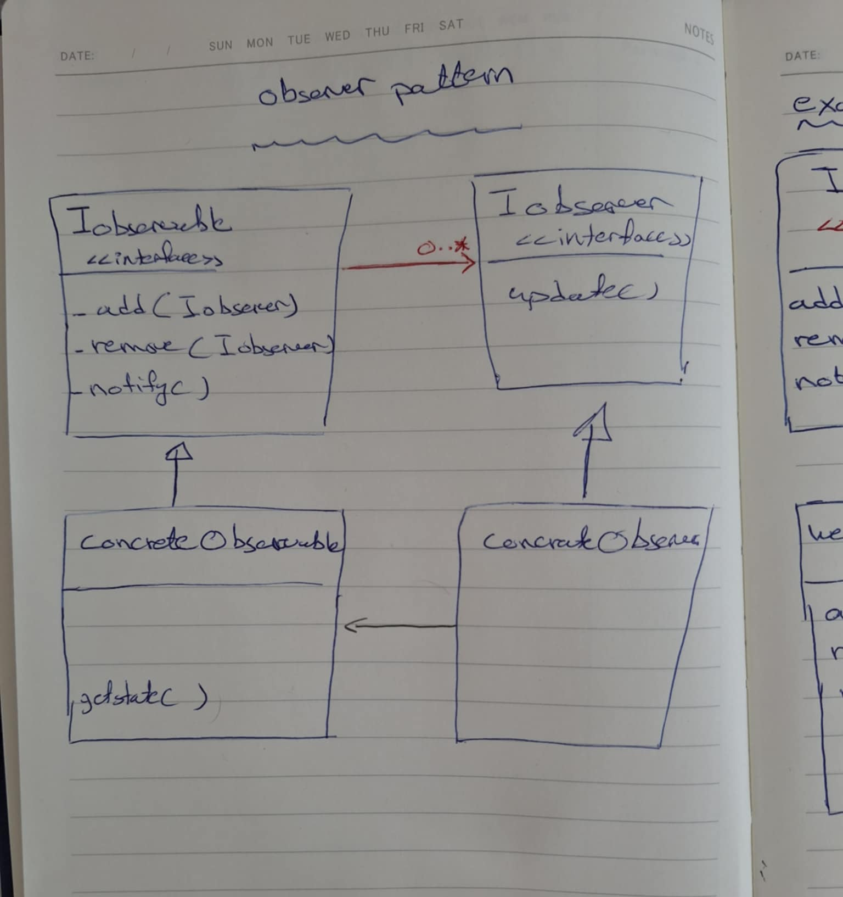

## Observer pattern UML

## Example: Weather station UML

notify in IObservable will call update in IObserver
and the concrete class of Iobserver has instance of the concrete class of IObservable so it can read the updates
